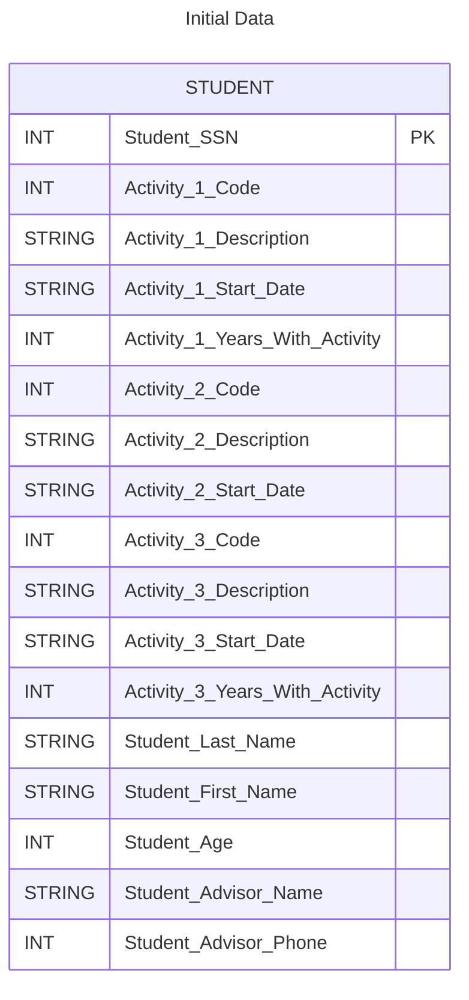
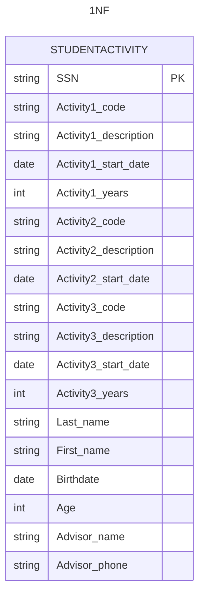
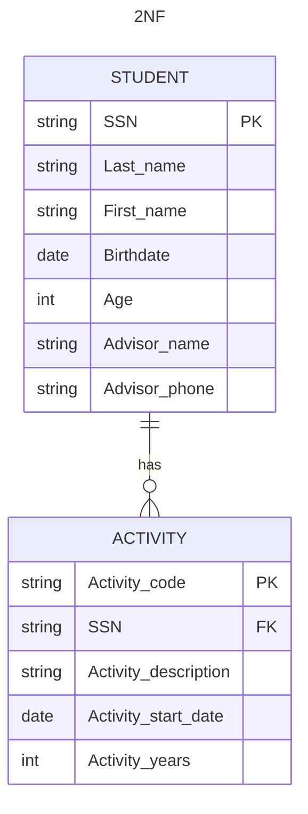
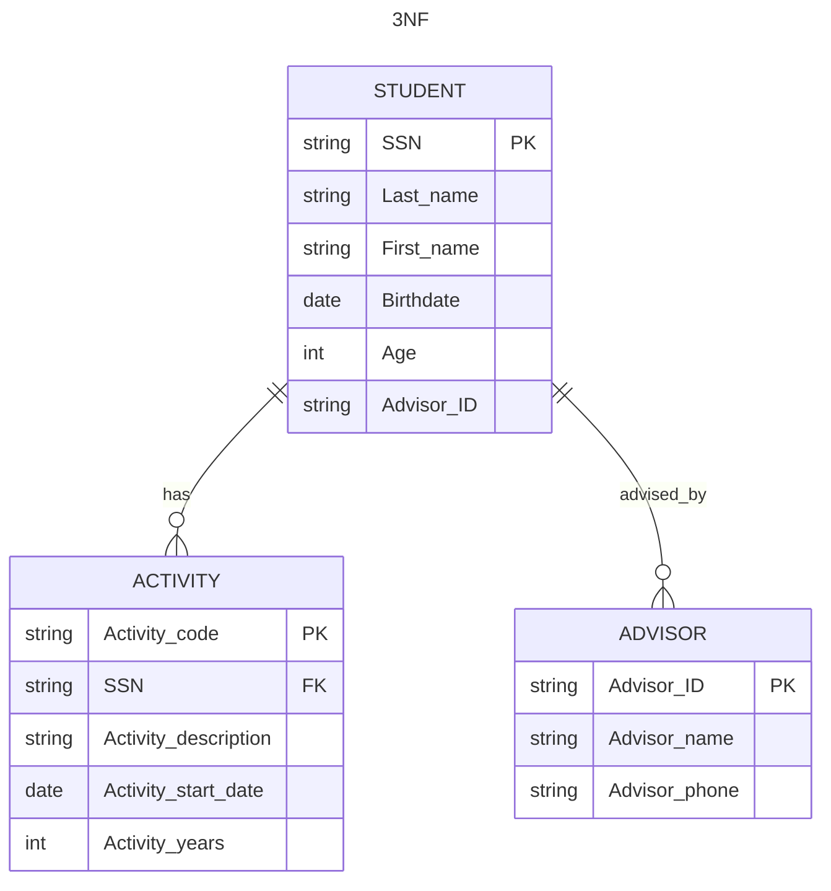

# Assignment 2 - ER Diagram for Student Activities 1NF -> 3 NF

```mermaid
---
title: Initial Data
---
erDiagram
    STUDENT {
        INT Student_SSN PK
        INT Activity_1_Code
        STRING Activity_1_Description
        STRING Activity_1_Start_Date
        INT Activity_1_Years_With_Activity
        INT Activity_2_Code
        STRING Activity_2_Description
        STRING Activity_2_Start_Date
        INT Activity_3_Code
        STRING Activity_3_Description
        STRING Activity_3_Start_Date
        INT Activity_3_Years_With_Activity
        STRING Student_Last_Name
        STRING Student_First_Name
        INT Student_Age
        STRING Student_Advisor_Name
        INT Student_Advisor_Phone
    }    
```

```mermaid
---
title: 1NF
---
erDiagram
    STUDENTACTIVITY {
        string SSN PK
        string Activity1_code
        string Activity1_description
        date Activity1_start_date
        int Activity1_years
        string Activity2_code
        string Activity2_description
        date Activity2_start_date
        string Activity3_code
        string Activity3_description
        date Activity3_start_date
        int Activity3_years
        string Last_name
        string First_name
        date Birthdate
        int Age
        string Advisor_name
        string Advisor_phone
    }
```

```mermaid
---
title: 2NF
---
erDiagram
    STUDENT ||--o{ ACTIVITY : has
    STUDENT {
        string SSN PK
        string Last_name
        string First_name
        date Birthdate
        int Age
        string Advisor_name
        string Advisor_phone
    }
    ACTIVITY {
        string Activity_code PK
        string SSN FK
        string Activity_description
        date Activity_start_date
        int Activity_years
    }
```

```mermaid
---
title: 3NF
---
erDiagram
    STUDENT ||--o{ ACTIVITY : has
    STUDENT ||--o{ ADVISOR : advised_by
    STUDENT {
        string SSN PK
        string Last_name
        string First_name
        date Birthdate
        int Age
        string Advisor_ID
    }
    ACTIVITY {
        string Activity_code PK
        string SSN FK
        string Activity_description
        date Activity_start_date
        int Activity_years
    }
    ADVISOR {
        string Advisor_ID PK
        string Advisor_name
        string Advisor_phone
    }
```

